# 17. Flowchart

> Kumpulan flowchart (Mermaid) untuk setiap proses penting di FUTSIGHT. Diagram dapat dirender langsung di GitHub/GitLab/VSCode dengan plugin Mermaid.

---

## 1. Flowchart Sistem Keseluruhan

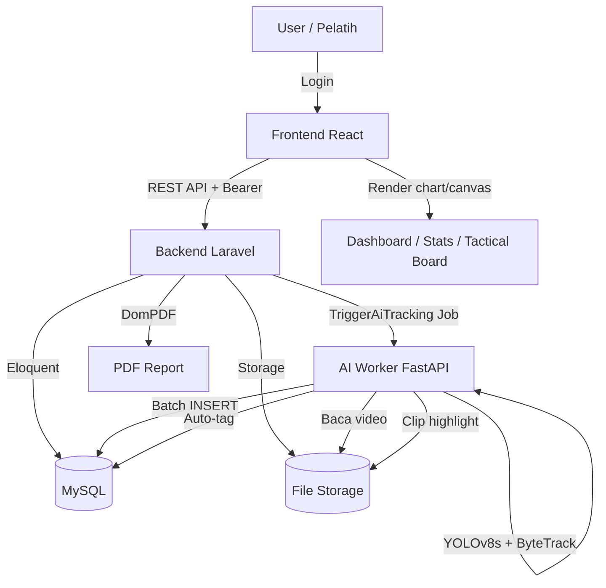

---

## 2. Flowchart Autentikasi

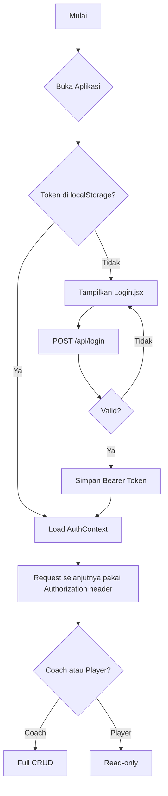

---

## 3. Flowchart Upload Video

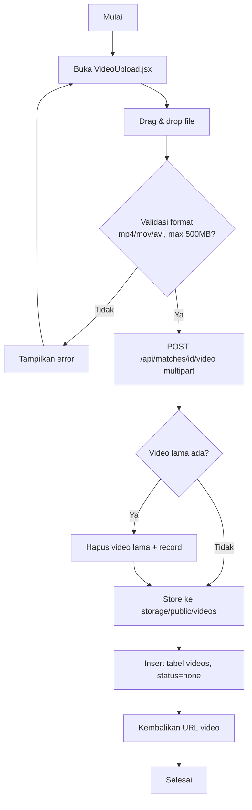

---

## 4. Flowchart AI Tracking (End-to-End)

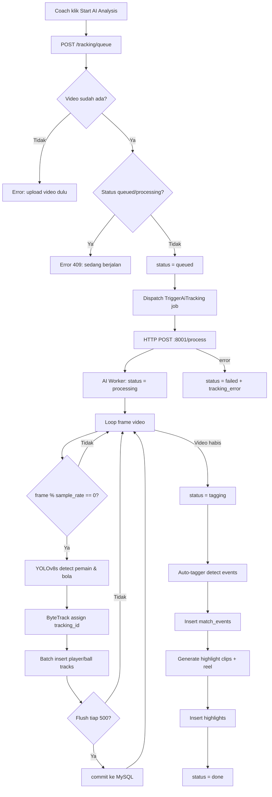

---

## 5. Flowchart Auto-Tagging (Goal Detection)

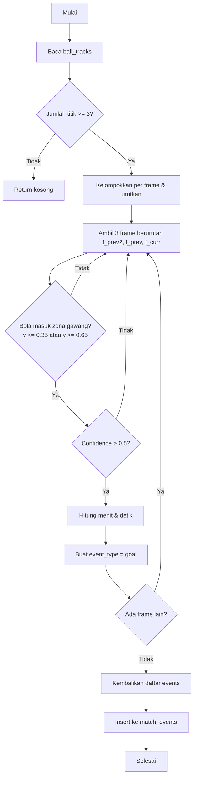

---

## 6. Flowchart Live Tagging (Manual Event)

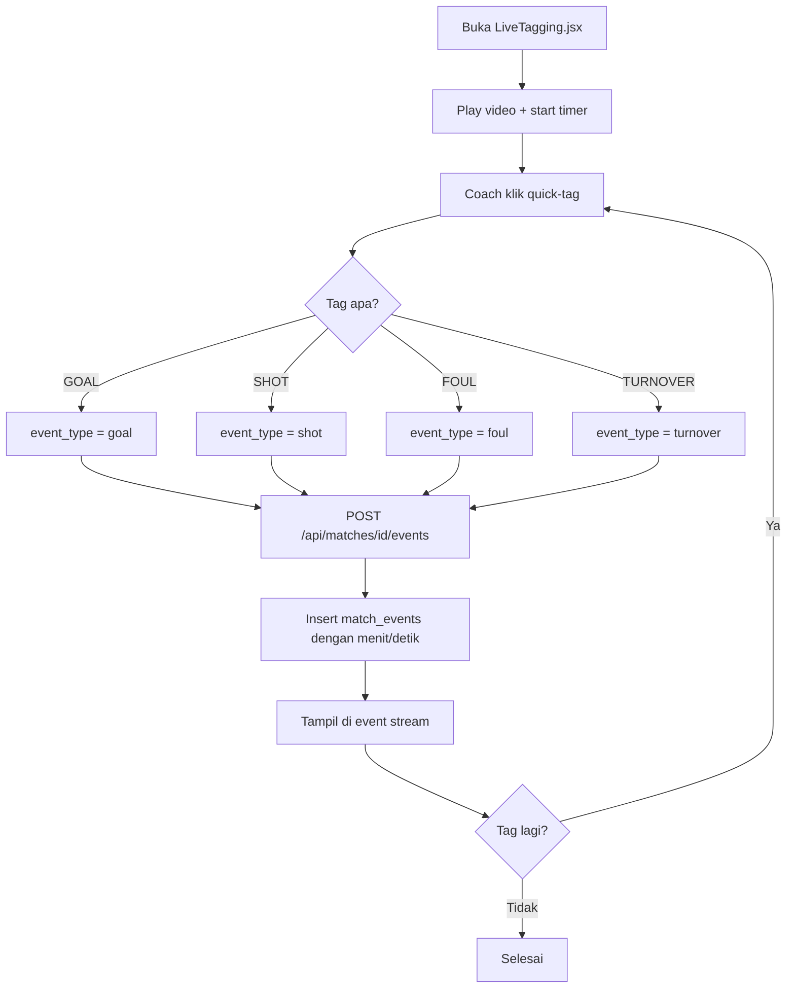

---

## 7. Flowchart Statistik

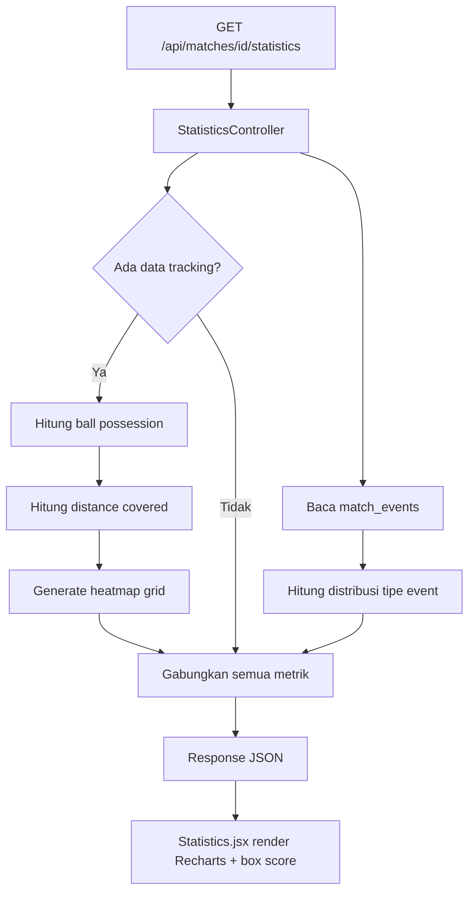

---

## 8. Flowchart Tactical Board

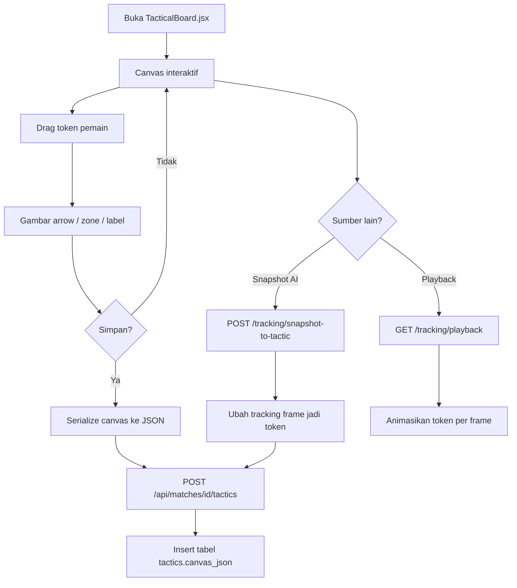

---

## 9. Flowchart Highlight Generation

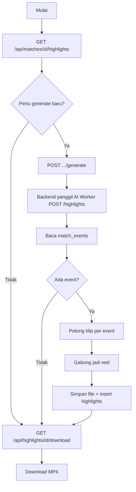

---

## 10. Flowchart PDF Report

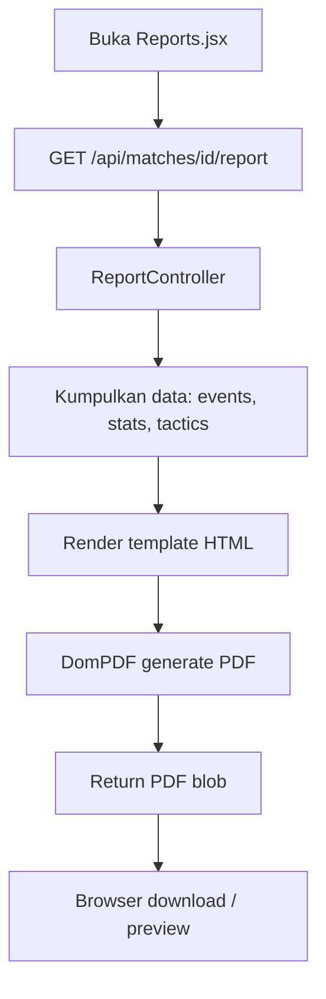

---

## 11. Flowchart State Machine Tracking Status

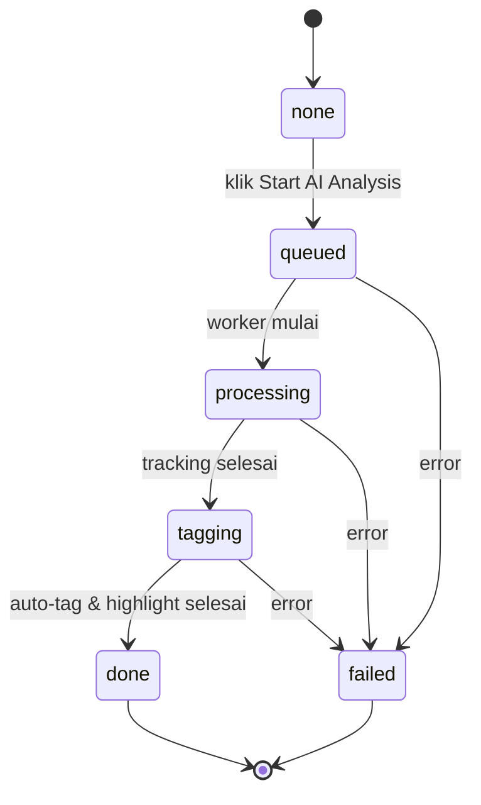

---

## 12. Legenda Simbol

| Simbol | Arti |
|---|---|
| `[ ]` / persegi | Proses / langkah |
| `{ }` / diamond | Keputusan (branching) |
| `[( )]` / cylinder | Database / storage |
| `-->` | Alur normal |
| `-->|label|` | Alur dengan keterangan |
